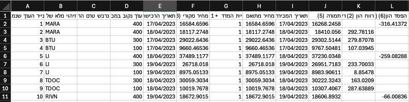
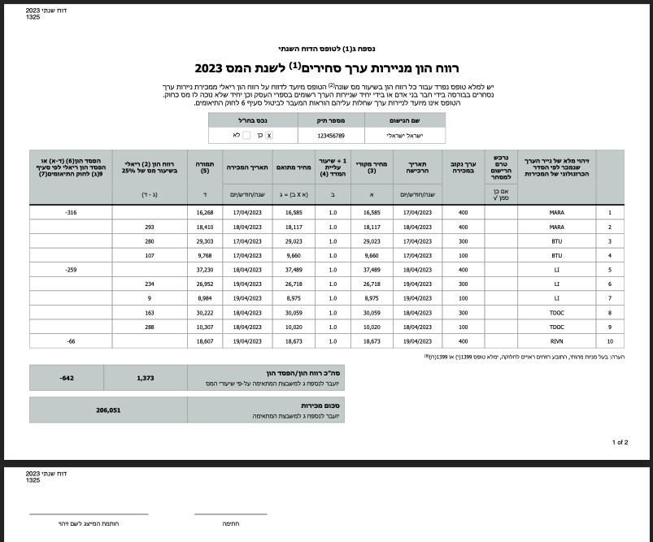

# TaxUtilities
 
This repository contains `python` utility tools for assisting with tax-related calculations and form preparations:

## Converting Colmex Pro's orders report to form 1325
### Description
Form 1325 is a form required by Israeli tax authorities from traders and investors whose brokers don't deduct witholding 
tax.

This tool parses the orders CSV report provided by Colmex Pro, and can generate Form 1325 as either a CSV file or as 
a PDF file. It also calculates the relevant currency rates from BOI API (currently only supports USD), as described 
[here](https://fintranslator.com/israel-tax-return-example-2019/).

---

### Installation
1. Clone the repository
2. Install dependencies: `pip install -r requirements.txt`

---

### Pre-requisites
To run the tool, you need the orders CSV from Colmex Pro. In order to get it, do the following:
- Log in to your Colmex Pro MTS account
- Go to `Trade History`
- Select the `From date` & `To date`
  - Important: The `From date` & `To date` should have the **same year** for the tool to work.
- Click `Go`
- Click `Excel`

---

### Usage
In order to generate the form, there are several arguments you need to pass:
- The path to your orders `csv` file from Colmex Pro
- The desired path of the output file (The tool currently supports `csv` and `pdf` file extensions only)

When using PDF output file, the following arguments are also required:
- Your full name 
- Your tax authorities file number (usually your ID number)
- Whether the assets you are trading are abroad (Valid values are `True` and `False`)

In order to run the tool you can use this command from your terminal: \
`python -m colmex_pro_to_form_1325.src [INPUT FILE] [OUTPUT FILE] --name [NAME] --file_number [FILE NUMBER] 
--asset_abroad [ASSET ABROAD]`

For example: \
`python -m colmex_pro_to_form_1325.src "/path/to/orders/file.csv" 
"/path/to/output/form_1325.pdf" --name "ישראל ישראלי" --file_number 123456789 --asset_abroad True`

---

### Output Examples
#### CSV

#### PDF

---

### DISCLAIMER
This tool is provided for informational purposes only and is NOT a substitute for professional tax advice or services, 
nor does it provide legal, financial, or tax advice of any kind. 
The author of this tool is NOT a tax professional, so users should consult an accountant or a professional tax advisor 
to ensure the accuracy of tax information.

The author is not responsible for any errors or omissions, or for any losses or damages incurred as a result of using 
this tool.

By using this tool, you acknowledge and accept these terms.